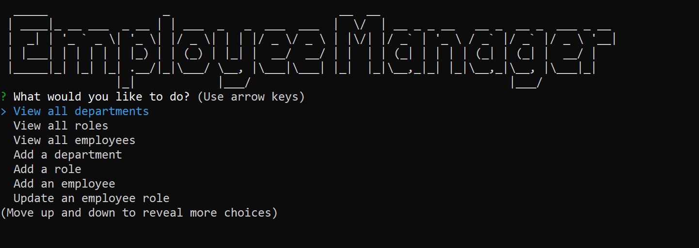

# Employee Tracker Application

This application allows users to view, update and add employee data in a MySQL database through a command-line interface.

## Table of Contents

- [Installation](#installation)
- [Usage](#usage)
- [Deployment](#deployment)
- [License](#license)

## Installation

To install and run the application, use the following steps

1. Clone the repository to your local machine:

```bash
git clone https://github.com/darylbg/employee-tracker.git
```
2. Navigate to the installed directory folder and install all dependency packages:

```bash
npm install
```
3. Set up the MySQL database by adding your credentials to the .env file, then to initialize the data structure and populate it, open your Mysql shell and run 
```bash
source db/schema.sql
source db/seeds.sql
```

4. Then start the application in the command line by running
```bash
npm start
```

## Usage

This application would be used to track and update employee data through a series of command line prompts and inputs.

The application allows you to:

- View all employees, roles, or departments
- Add a new employee, role, or department
- Update an employee's role or manager

## Deployment

This application is not deployed live, but it can be installed locally and ran as shown [here](#installation).
* A walkthrough video of the application in use can be found [here](https://www.youtube.com/watch?v=5s-8fIUCF0w).
* The source code for this project can be found [here](https://github.com/darylbg/employee-tracker)
* The app start menu will look like the following screenshot 

## License

This application is licensed under the [MIT License](https://opensource.org/licenses/MIT).
